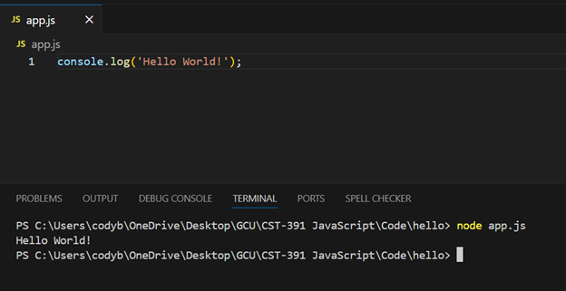

# Activity 0

- Cody Crosby
- CST-391
- Bobby Estey
- September 7, 2025

## Introduction 
This activity introduced the basic setup and use of Node.js, Express, and TypeScript for building simple server-side applications. It covered the installation and code needed to serve a response from a local web server.

## Part 1

### Node/NPM Versions

- This image shows the node and node package manager versions

### NodeJS - Hello World

- This image shows the Hello application executing in the terminal

### Express - Hello World

- This images shows the Hello Express application executing on port 3000

### Nodemon

- This images shows the Hello Express application executing on port 3000 using nodemon

## Part 2

### Express/TypeScript

- This images shows the Hello TypeScript application executing on port 3000

### app.ts

- This image shows the Hello TypeScript code with comments

## Conclusion
- This activity covered how to install Visual Studio Code, NodeJS, Express, and TypeScript. Three applications were created to demonstrate the how to use each.

     - NodeJS Hello World Application
     - Express Hello Express Application
     - TypeScript Hello TypeScript Application
