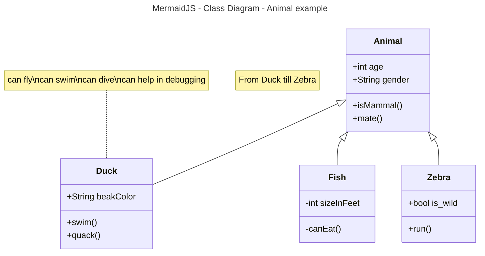

#  Activity 1

## Introduction 

- This is **Activity 1** blah blah blah 

## Fruits

1. pears
2. Cherries
3. Apples
     1. Red
     2. Yellow
     3. Green
4. Oranges

## Fruits

- pears
- Cherries
- Apples
     - Red
     - Yellow
     - Green
- Oranges

## Links / Images
[wikiBob](https://gitlab.com/bobby.estey/wikibob/-/blob/master/README.md)

[Google](https://google.com)


## Tables
|First Name|Last Name|
|--|--|
|Cody|Crosby|
|Corbin|Crosby|


## Code Blocks
```java
public class CodeBlock {
    public static void main(String[] args) {
        System.out.println("Code Block Example");
    }
}
```


