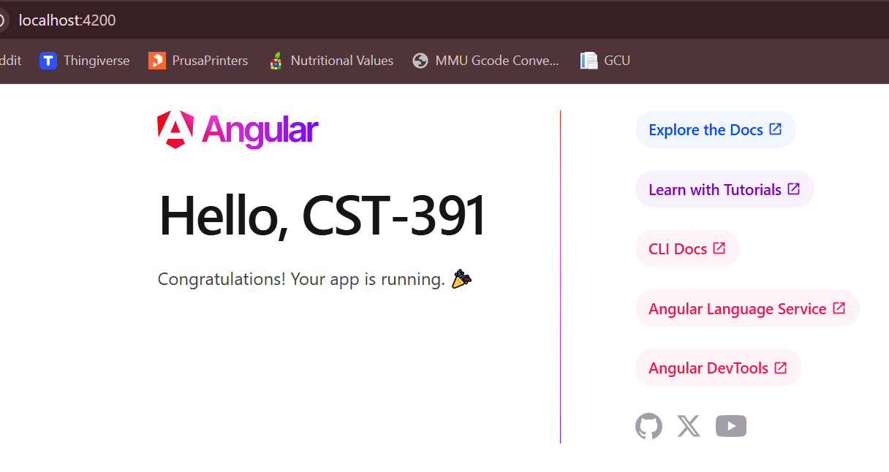

# Activity 2

- Author:  Cody Crosby
- Date:  14 September 2025

## Introduction

- This activity will create a Hello World application to teach the basic principles of how to install and use the front-end framework Angular.

## Screenshots 

- Install of latest Angular version

- Hello World Angular application

- Updated app.component.ts

- Adding variable to component

## Research

- A:
    - Folders:
        - node_modules/ contains the libraries and dependencies used by Angular
        - src/ is the main application folder and holds the code and config files
        - src/app/ contains components, modules, and routing
        - src/assets/ is for static resources like icons and fonts
        - src/environments/ stores environment config files like env.ts

    - Files:
        - angular.json is the main Angular file used to define how the project is built
        - package.json holds metadata, lists of dependencies, and defines scripts
        - tsconfig.json is a TypeScript config file and controls compiler settings

- B:
    - When serving an Angular project, the TypeScript, HTML, and CSS is combined into JavaScript that is then run in the browser. The page displayed is a result of the root module and rendering the root component.
    - main.ts is the application's entry point and is used to tell Angular where to start the app.
    - app.module.ts is the root module, used to declare the root component and import other components
    - app.components.ts defines the TypeScript for the root component and is linked to the HTML and CSS files
    - app.component.html is the template for the root component. It's the actual HTML inserted into the page
    - app.component.css is the stylesheet for the root component and is a place to hold all CSS for only the component

## Conclusion

- This activity went over basic key concepts of Angular. To include:
    - Install
    - Project creation
    - Component variables
    - File structure

