# Activity 3

 - Author:  Cody Crosby
 - Class: CST-391
 - Date:  21 September 2025

## Introduction

 - This activity will cover how to create responsive Angular application with dynamic routing and component interaction. 

## Part 1 

 - Bootstrap grid in large and small windows to demonstrate responsiveness

 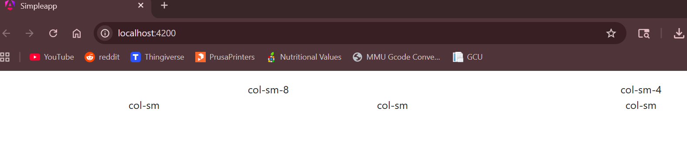

 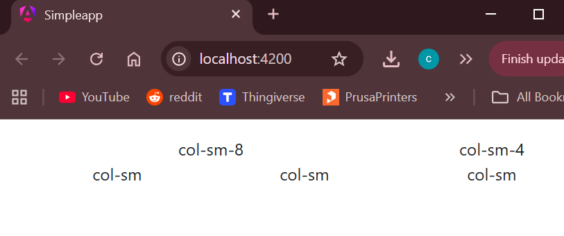

 - Shop component with form submission

 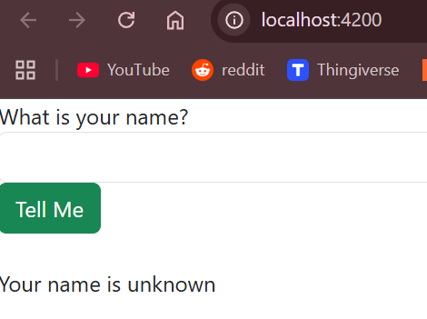

 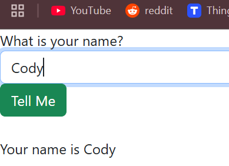

 - JS console for Info submit event

 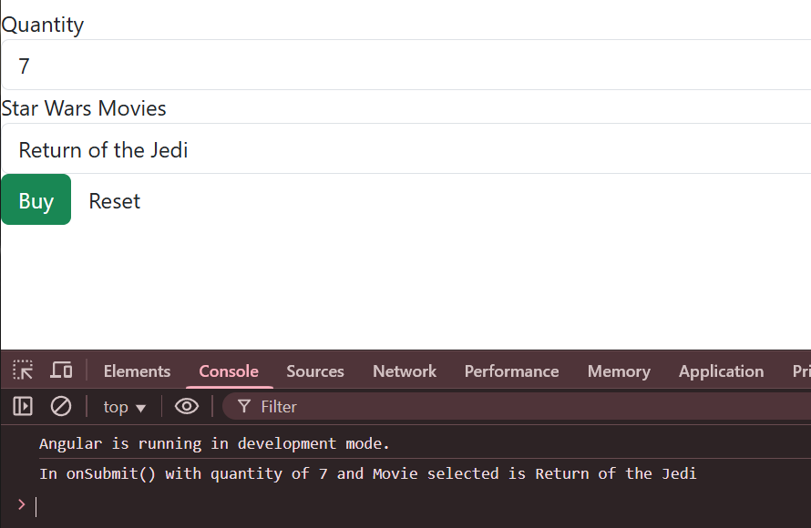

 - App page prior to entering name
 
 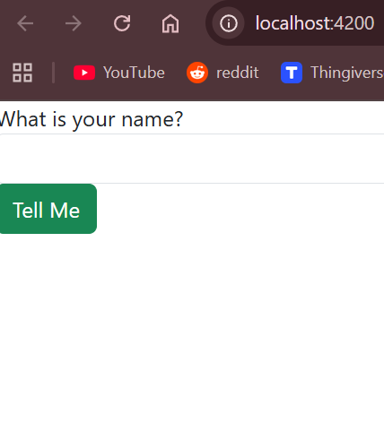

 - Page update once name has been given

 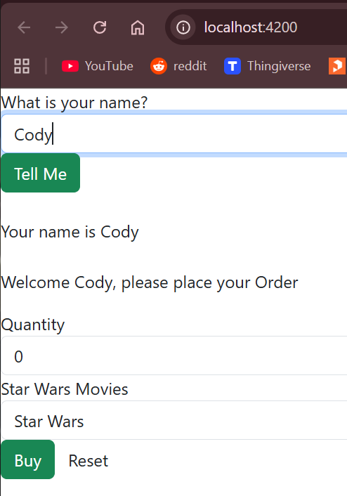

### Research 

 1. The @Input decorator is used to pass data to a new component, in this case the Shop component is sending the name variable into the Info component.

 2. [Value] is used to dynamically set the value of an HTML element from the component. For the Info component, it is the name of the individual movies.

 3. [(ngModel)] is a two way binding that is used to ensure the component and template are properly synchronized after form actions.

## Part 2

 - Home page for the music app

 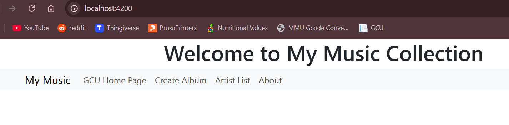

 - NavBar link to GCU homepage

 

 - Create album form 

 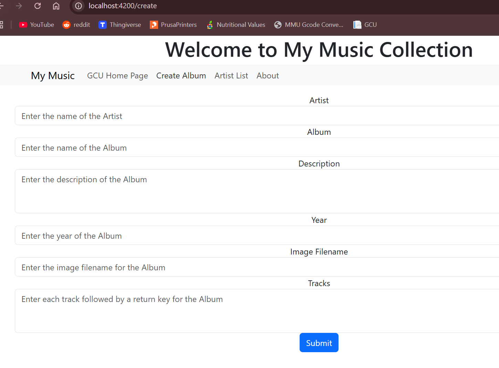

 - List of all artists

 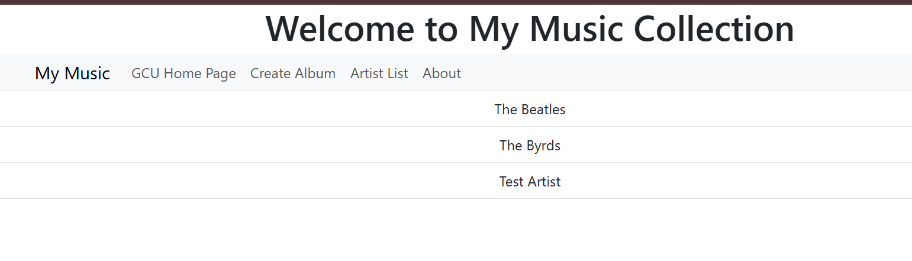

 - Message box for about page
 
 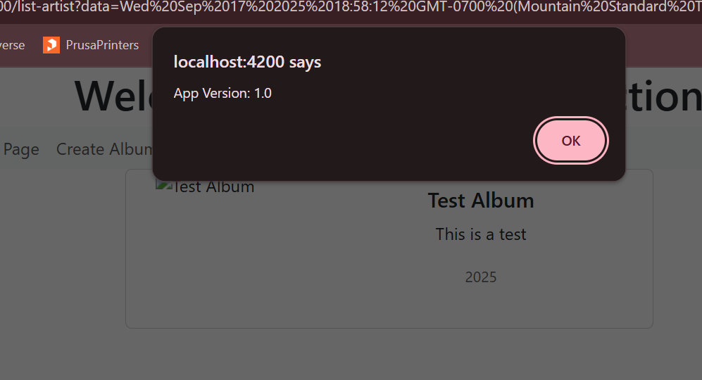

 ### Research

  - Comments for music-service.service.ts

  ```JavaScript
    export class MusicServiceService {

    // A list of albums pulled from a JSON file and stored in memory to serve as the database
    albums: Album[] = exampledata;

    // Method to get a list of all artists
    public getArtists(): Artist[] {
        let artists: Artist[] = [];
        let artistSet = new Set<string>();

        // Get artist name and add to set
        this.albums.forEach(a => artistSet.add(a.artist));

        // Convert set into array of Artist
        artistSet.forEach(a => artists.push({artist: a}))
        return artists;
    }

    // Get list of all albums
    public getAlbums(): Album[] {
        // Return the list of Albums
        return this.albums;
    }

    // Get all albums from given artist
    public getAlbumsOfArtist(artistName: String): Album[] {
        let albums: Album[] = [];

        // Loop through albums and select any by given artist
        this.albums.forEach(album => {
        if (album.artist == artistName) {
            albums.push(album);
        }
        });
        return albums;
    }

    // Add a new album to db
    public createAlbum(album: Album): number {
        // Add a new Album to the list of Albums
        this.albums.push(album);
        return 1;
    }

    // Update an existing album
    public updateAlbum(album: Album): number {
        // Search for the Album in the list of Albums and replace it in the list
        for (let i = 0; i < this.albums.length; ++i) {
        // Replace old album with new one
        if (this.albums[i].albumId == album.albumId) {
            this.albums.splice(i, 1, album);
            return 0; // Successfully replaced
        }
        }
        return -1; // Album not found
    }

    // Delete album by ID
    public deleteAlbum(id: number): number {
        // Search for the Album in the list of Albums and delete from the list
        for (let i = 0; i < this.albums.length; ++i) {
        if (this.albums[i].albumId == id) {
            // Remove album at index
            this.albums.splice(i, 1);
            return 0; // Album removed
        }
        }
        return -1; // Album not found
    } 
  ```

## Conclusion

 - This activity built an Angular application used to manage music, and eventually use the MusicAPI from earlier activities. Key concepts covered include: 
    - Angular routing
    - Template forms
    - Component communication

