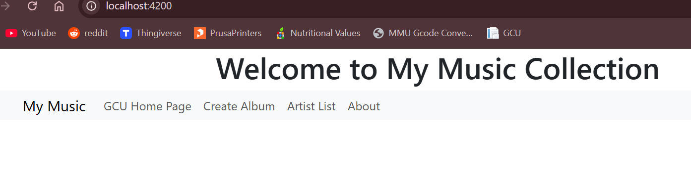
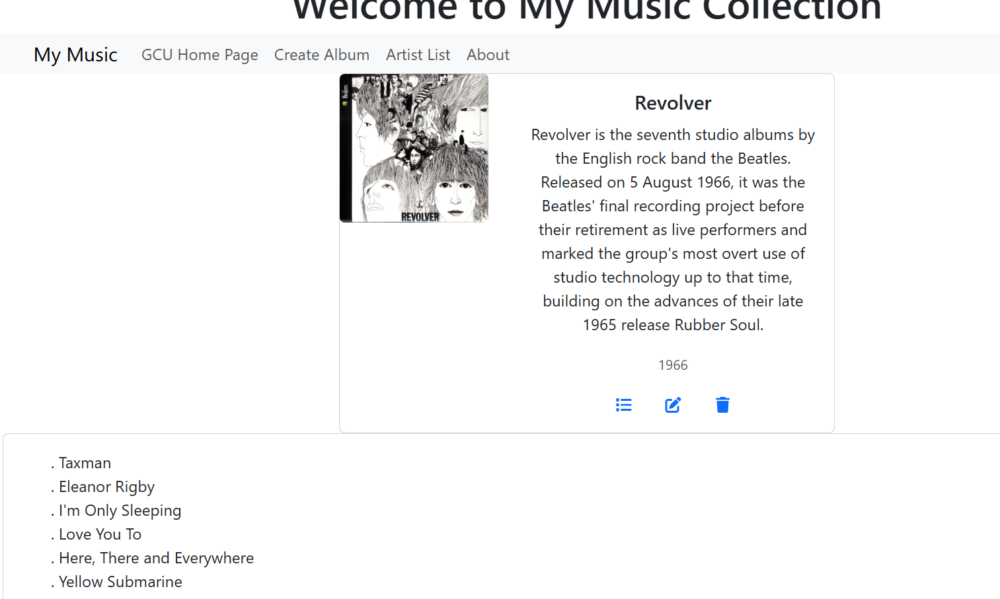

# Activity 4

 - Author:  Cody Crosby
 - Class: CST-391
 - Date:  28 September 2025

## Introduction

 - This activity will cover how to convert the Angular front-end from using hard-codded sample data to consuming the Express REST APIs created in a previous assignment.The focus will be on wiring the layers together so that the Angular application can preform CRUD operation with persistence on the database.

## Part 1 

 - The home screen displays the title of the app and includes a navbar with links to key sections for listing artists, creating new albums, displaying version details, returning home, and navigating to the GCU homepage.

 

 - The artist list screen retrieves data directly from the backend instead of relying on hard-coded values. Each artist is displayed as its own clickable option to allow users to interact with the records.
 
 

 - Once an artist is selected, the album list screen returns a view with all albums for that specific artist.

 

 - Clicking an album loads a card view with the album’s details, including its title, description, release year, and cover image. Users then have options to update, delete, or view the tracks for the album.

 

 - This form allows users to create a new album. The form includes all necessary fields (title, artist, year, description, image, and track details). Submitting the form triggers a POST request to the API, dynamically updating both the frontend and backend.

 

 - Confirming the success of the create operation by inspecting the database to show the newly added album appearing in the table.

 

 - A confirmation message is shown when attempting to delete an album to prevent accidental removals. After confirming, a popup success message is displayed to give the user feedback.

 

 - Viewing the database confirms the selected album is removed from the table. This validates that the Angular application can successfully perform multiple types of CRUD operations. 

 

 ### Research
 
 - Angular maintains its logged in state through the use of authentication tokens. The server generates a token for users when they log in, and Angular stores it in session storage. Each API request then uses this token to prove identity, allowing the backend to enforce access control.

## Conclusion

 - This activity covered how to refactor the Angular frontend from using placeholder data into running on a live Express API backend. The app can now supports the full CRUD operations of albums and their tracks.

