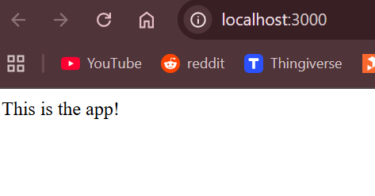
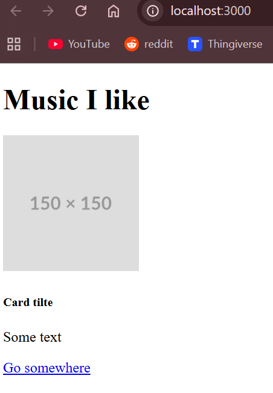
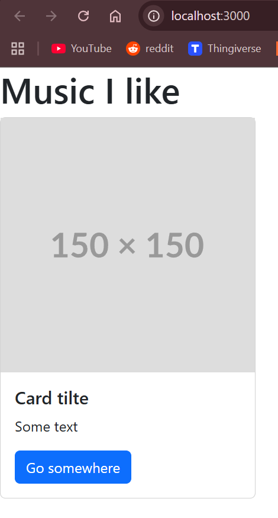
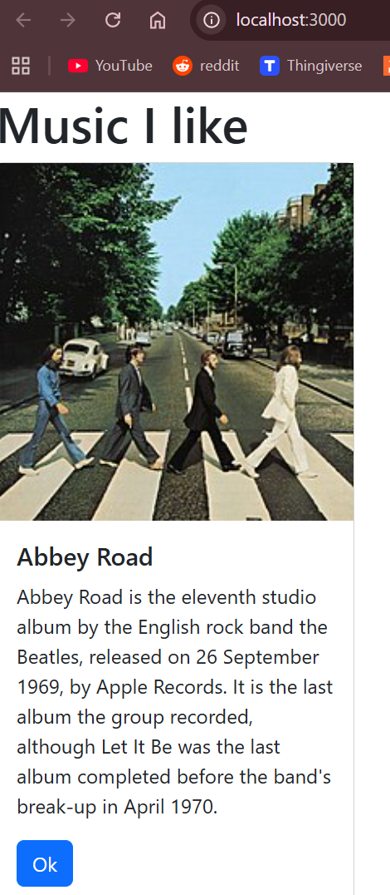
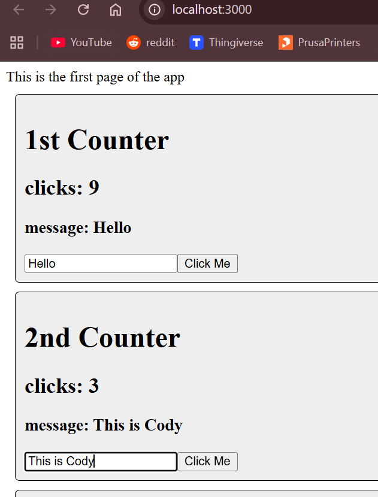
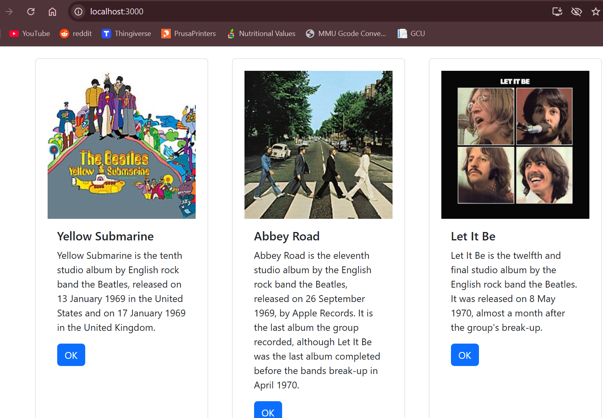

# Activity 5

 - Author:  Cody Crosby
 - Class: CST-391
 - Date:  5 October 2025

## Introduction

 - This activity will conver the creation of a front end using the React framework. The activity will focus on learning the basics of React by building a small music application. Starting with creating components and passing details with props. Then state will be explored to enable dynamic creation of components.

## React Music App 

 - Displays simple text in React to confirm the environment is set up correctly

 

 - The card was created with raw HTML and JSX inside React to demonstrates the structure of a card before styling
 
 

 - This version uses bootstarp to apply styling. It is formatted as a traditional bootstarp card

 

 - The card has been converted into a seperate component. The details are added dynamically through the user of props

 

### Summary

 - This section introduced the basics of creating a React front end. We started with a simple proof of concept, then built card to represent albums. The card was made into it's own component were props could be used to pass details into it.

## State Changer

 - A basic counter that updates the number of clicks and message. Demonstartes how states can be used to update and re-render components

 

## State and Props in Music App

 - Updated albums cards moved away from hardcoding to update data through state

 

 ### Summary
 
 - This section updated the music app by including state. The album data was added to the component state with a list. The map fucntion was then used to dynamivally generate each card. The album data is still currently hardcoded, but will be updated to pull from the MusicAPI from earlier assignments.
  
## Conclusion

 - This activity demonstrated how to build a dynamic from end using React. It began with a simple text render, moved into building reusable card components, and introduced props for passing data into those components. State was then used to manage a list of album details to dynamically create the cards. Key concepts include: 
   - Setting up React
   - Building Compnents
   - Passing data with props
   - Implementing state