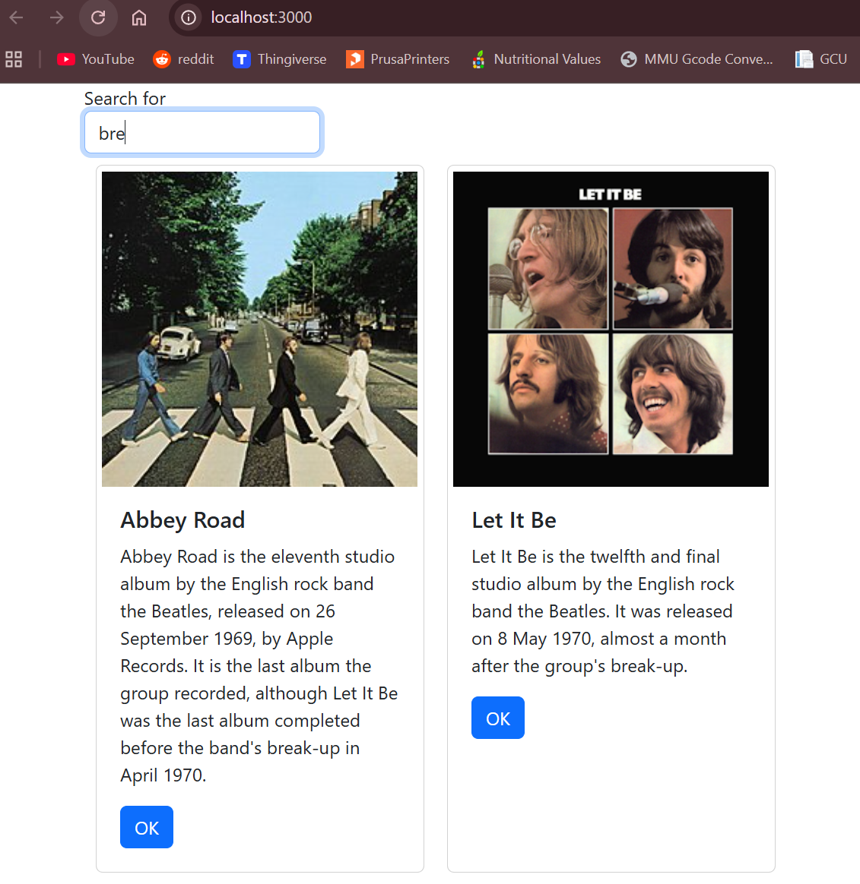
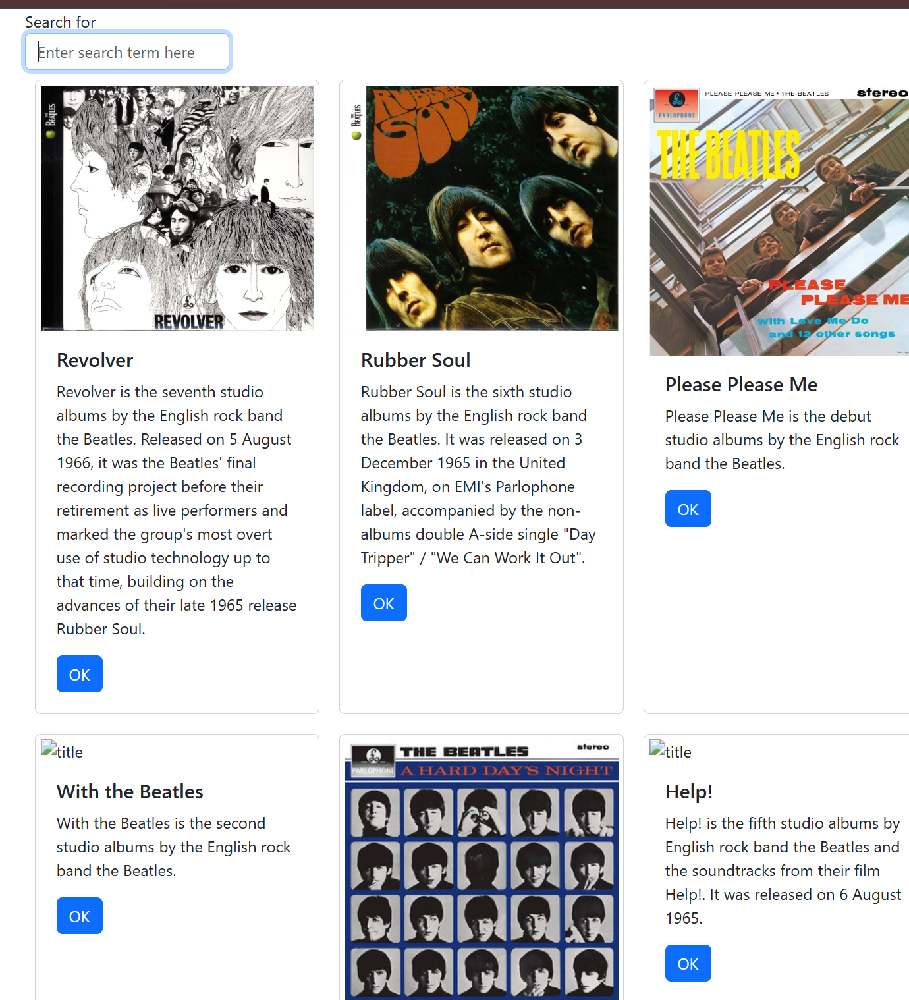
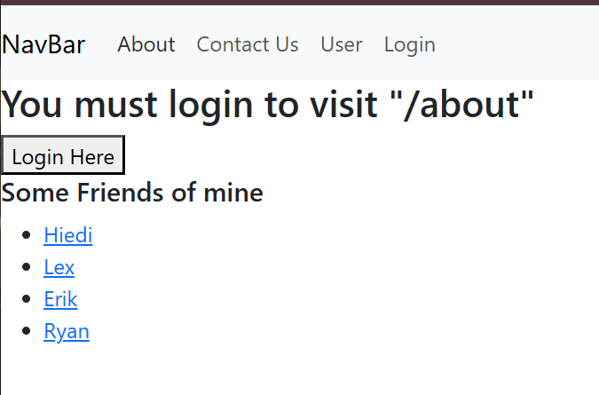
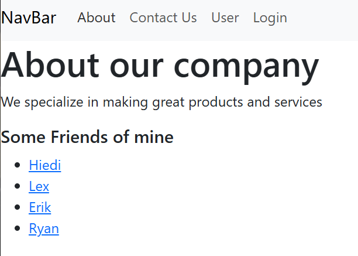
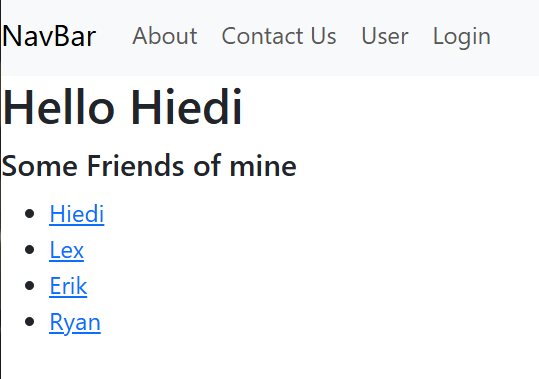
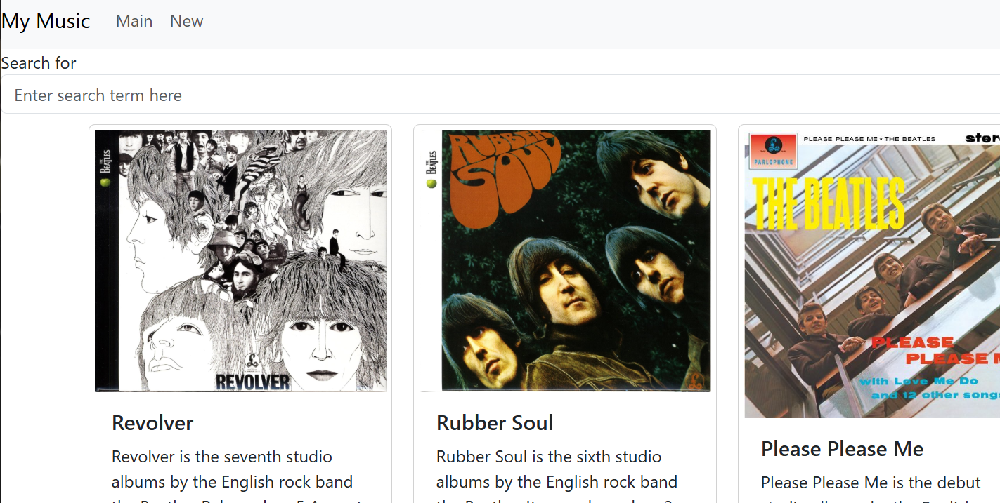
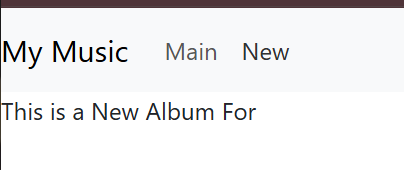

# Activity 6

 - Author:  Cody Crosby
 - Class: CST-391
 - Date:  12 October 2025

## Introduction

 - This activity focuses on expanding the React front end built in the previous assignment. This included integrating search capabilities, connecting to external APIs data management, and implementing navigation routing. The application will be able to retrieve live data, handle user interactions more effectively, and provide a smoother user experience.

## External Data Source

 - A text box was added to enable searching by description keywords, including parial matches
  
 

 - The application was updated to pull live data from the MusicAPI instead of relying on hardcoded or local data

 

### Summary

 - This section integrates external API and basic search functionality into the application. Users can now search for albums by keywords and the application retrieves data directly from the MusicAPI created earlier in the course.

## Mini App

 - Restricted pages now redirect users to the login screen before granting access

 

 - Once logged in, users can view the rescricted pages (About Us, Contact Us, ect.)

 

 - User page displays a welcome message and includes the selected user’s name

 

### Summary

 - This section walked through building a small demonstration application to show how routing and authentication work in React. Several new components, such as About Us, Contact Us, and User, were created to represent individual routes. Private routing was implemented so that only logged-in users could access certain pages.

## Navigation Routing

 - A NavBar was added to the top of the application to provide quick access to different pages within the site

 

 - A temporary page was created to serve as a placeholder for creating a new album

 

 ### Summary
 
 - This section implemented the navigation and routing features from the mini app. The NavBar allows users to easily move between pages without refreshing the site, and the routing setup made it possible to break the application down into smaller components.
  
## Conclusion

 - This activity demonstrated how to integrate external APIs and implement routing within a React front end. It moved away from the static site that used hardcoded data and toward an interactive site with live data. Key concepts include:
    - Connecting React to an external API
    - Implementing routing and private routes
    - Component-based design