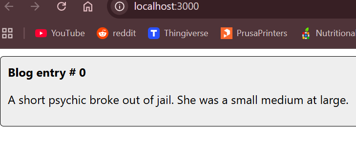
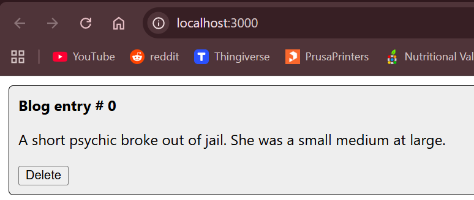
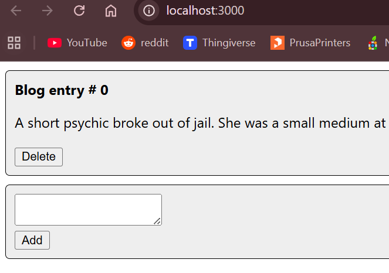
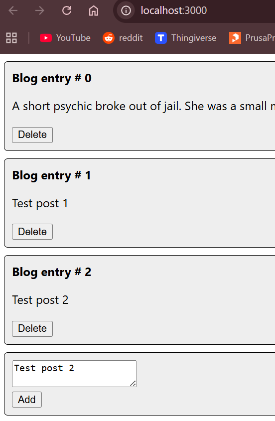
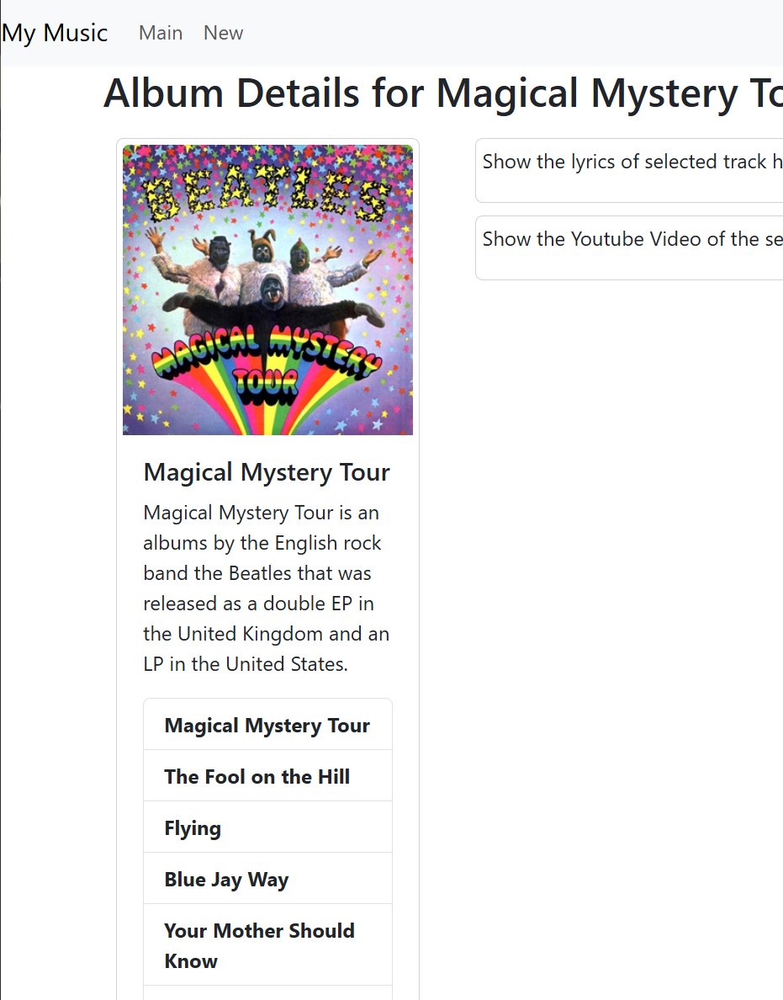
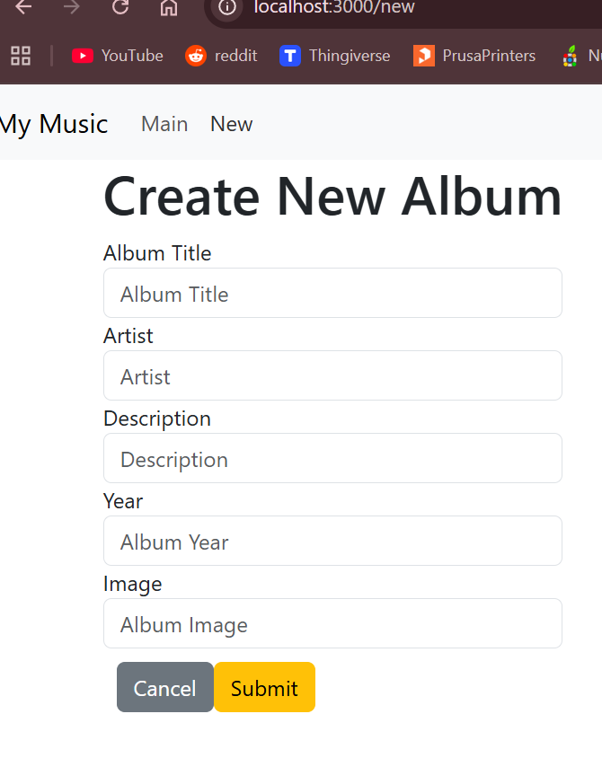
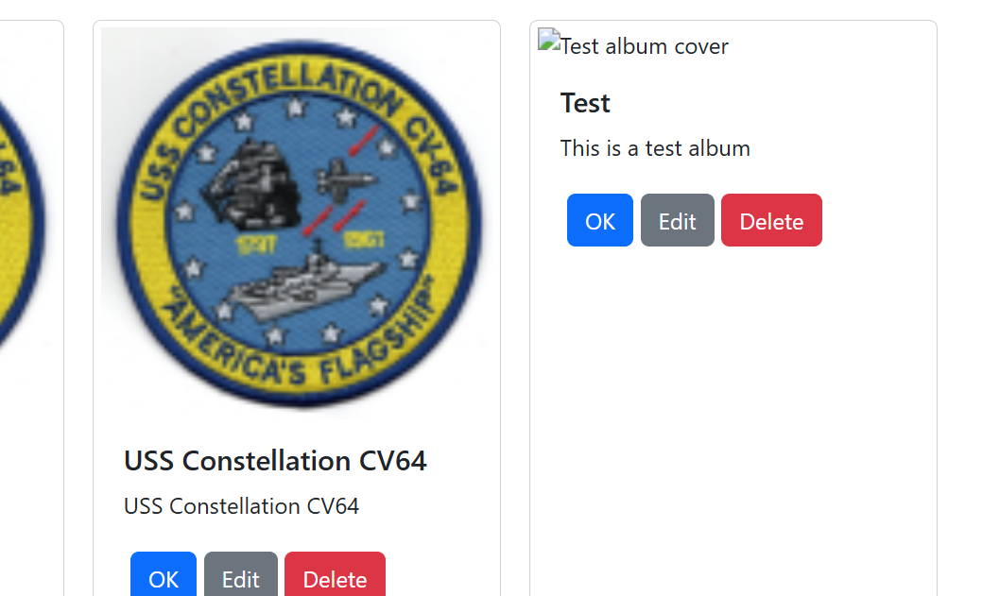
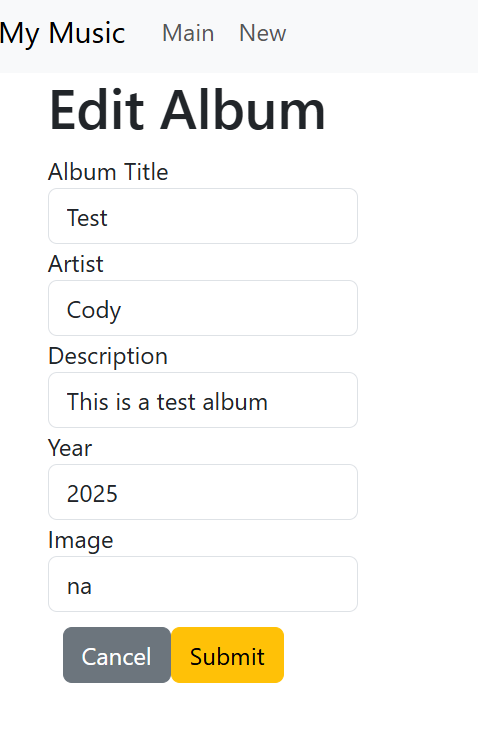
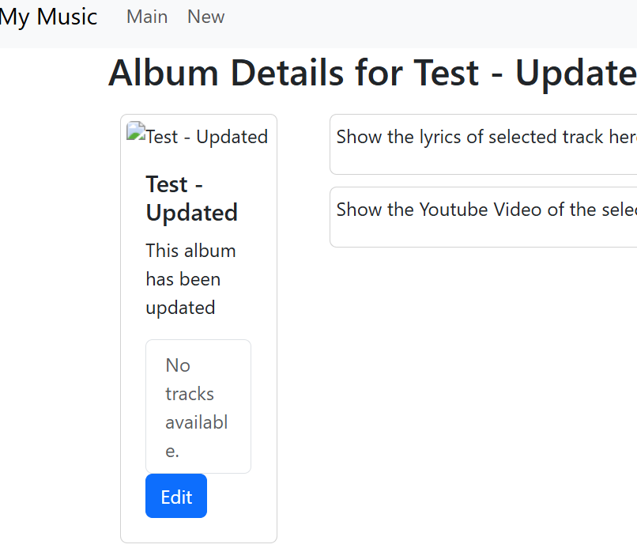
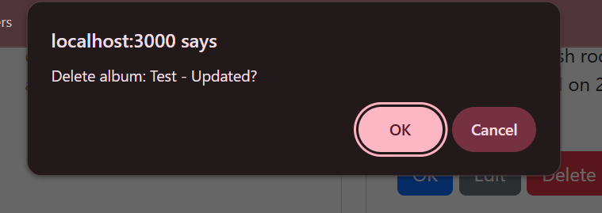

# Activity 7

 - Author:  Cody Crosby
 - Class: CST-391
 - Date:  19 October 2025

## Introduction

 - This activity continues to iterate on the React front end, expanding functionality to include all CRUD operations. The MusicAPI previously used only for reading data is now used for creating, updating, and deleting albums.

## Dynamic Components Demo

 - Blank blog post layout showing the component structure
  
 

 - Delete button added to allow removing individual posts

 

 - Add post button and form implemented to create new posts
 
 

 - Multiple posts displayed to confirm the list updates dynamically

 

## Tracks, Lyrics and Video

 - Album details view now includes sections for tracks, lyrics, and video
  
 

### Summary

 - This section expanded the album details page to include a list of tracks, lyrics, and the music video. Selecting a track updates the view with the corresponding information, making the album pages more interactive.

## Create New Album

 - Form added to allow users to create new albums in the database
  
 

 - Newly created album displayed dynamically after being saved

 

 ### Summary
 
 - This section added a form component for creating new albums. It included event handlers for submission, cancellation, and input changes. The album is saved to the database through the API and appeared in the updated album list.

## Edit an Album

 - Create album form modified to also handle editing existing albums
  
 

 - Album successfully updated and saved back to the database

 

 - Delete confirmation added for removing albums from the list

 

 ### Summary
 
 - This section enhanced the album form so it could handle both creating and updating albums. Users can now edit details, save changes, or delete entries. A confirmation step was added before deletion to prevent accidental removals.
  
## Conclusion

 - This activity expanded the React front end to include complete CRUD functionality. Users can now view album details, create new entries, update existing ones, and delete records through the Express API. Key concepts include:
    - Implementing CRUD operations in React through an API
    - Reusing form components for multiple actions
    - Managing state and props for components