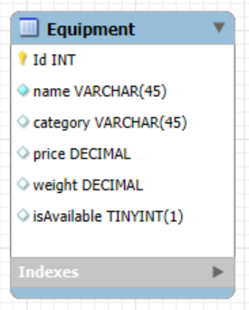
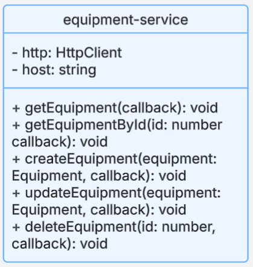

# Project Visuals & UML Diagrams

This page contains all visual documentation and diagrams related to Milestone 5.

---

## Sitemap

---

## Wireframes

### Home Page

### Search Page

### Add/Edit Page

### Details Page

---

## Database Design

---

## Class Diagrams

### Express APIs
 - Equipment Class  
  
 - EquipmentController  
  
 - EquipmentDAO  
  

---

### Angular Front-End
 - API Service
  
 - ListEquipment
  
 - EditEquipment
  
 - DeleteEquipment
  
 - CreateEquipment
  

---

### React Front-End
 - App.js  
  
 - EquipmentList.js  
  
 - EditEquipment.js  
  
 - SearchForm.js  
  
