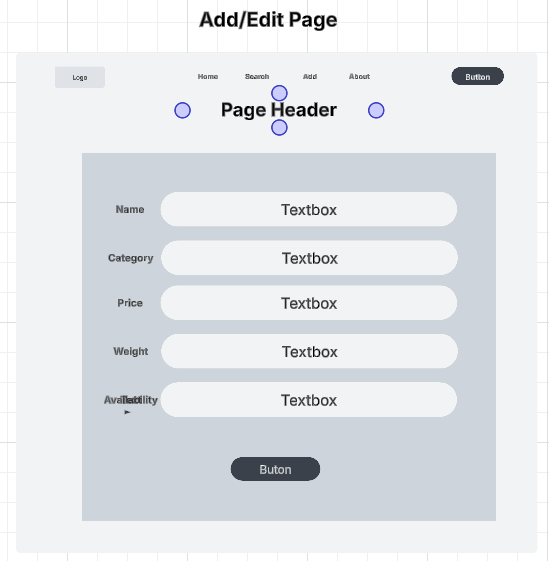
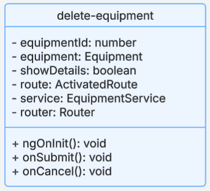
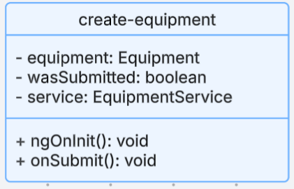

# Project Visuals & UML Diagrams

This page contains all visual documentation and diagrams related to the milestone project.
  
---

## Sitemap

    - Diagram braking down the general structure of the front end application(s)

---

## Wireframes

### Home Page

    - Home page of the site to welcome users

### Search Page

    - Displays list of all inventory items with search functionality to enable dynamic filtering

### Add/Edit Page

    - Reusable page to allow for editing existing items or creating new items

### Details Page

    - View to present all relevant data on a selected item

---

## Database Design

  - The Equipment table in the database, used to represent individual equipment itmes

---

## Class Diagrams

### Express APIs
 - Equipment Class  
  
    - The object model created from the database response and returned through the API calls
  
 - EquipmentController  
  
    - The main API controller used to expose CRUD operations externally
  
 - EquipmentDAO  
  
    - Data Access Object used to handle the actual database interactions

---

### Angular Front-End
 - API Service  
  
    - This class is used to handle API calls to the backend and return formatted objects
  
 - ListEquipment  
  
    - This component displays a list of equipment items to the main view
  
 - EditEquipment  
  
    - Form component for updating existing equipment items
  
 - DeleteEquipment  
  
    - Component to handle deletion of a component, includes confirmation prompt and cancel button
  
 - CreateEquipment  
  
    - Form component for creating new equipment items

---

### React Front-End
 - App.js  
  
    - The main view of the application and establishes routing
  
 - EquipmentList.js  
  
    - This component handles the creation of equipment cards to populate the main view of the inventory
  
 - EditEquipment.js  
  
    - A reusable component used to both edit existing equipment and create new equipment
  
 - SearchForm.js  
  
    - This form provides dynamic search functionality to the React front-end
  
