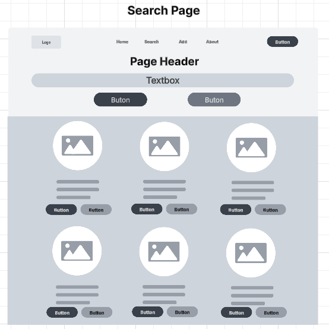

# Milestone 1

- Author:  Cody Crosby
- Date:  7 September 2025

## Introduction

- This project is an online management application designed for a gym equipment catalog. It will allow users to perform standard CRUD operations on various equipment types, with all data stored in a MySQL database. The catalog will maintain details such as equipment availability, category, pricing, and other details. The backend will be built using Node.js and Express to provide RESTful APIs for data manipulation. Two separate front-end applications, one in Angular and the other in React, will utilize these APIs.

## Requirements

- The application must:
    - Allow users to add equipment to the catalog

    - Allow users to update equipment details (price, category, etc.)

    - Allow users to delete equipment from the catalog

    - Allow users to view all available equipment in a list

    - Allow users to filter equipment by category

    - Store data in a MySQL database

    - Provide a REST API layer to handle CRUD operations

    - Provide two separate front-ends, Angular and React, that use the same APIs

## Sitemap

- Below is the Sitemap ...

## Wireframes

- Wireframes for:
    - Home Page

    
    - Search Page

    
    - Add/Edit Page

    
    - Details Page

    

## UML

- UML for:
    - Equipment Class

    
    - EquipmentController

    
    - EquipmentDAO

    

## ERDiagram

- Equipment ER Diagram

    

## Conclusion

- This milestone centered around the planing and design phase of the product development lifecycle. It provided opportunity to practice breaking down high level concepts into smaller components. This included creating different documents and diagrams, to include: 
    - Technical requirements
    - Sitemap
    - Wireframe
    - UML
    - ER Diagram