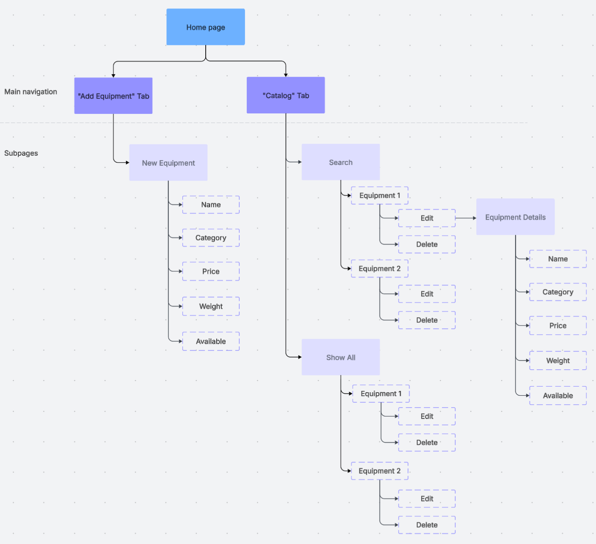
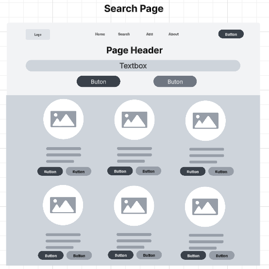
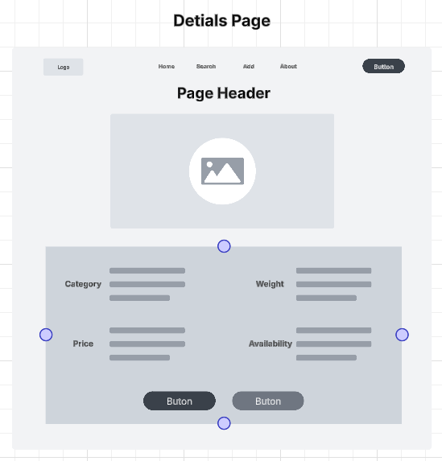

# Milestone 2

 - Author:  Cody Crosby
 - Date:  14 September 2025

## Instructor Feedback
 - The instructor has approved the initial submission. No further revisions are necessary beyond those required for the Milestone 2 submission.

## Introduction

 - This project is an online management application designed for a gym equipment catalog. It will allow users to perform standard CRUD operations on various equipment types, with all data stored in a MySQL database. The catalog will maintain details such as equipment availability, category, pricing, and other details. The backend will be built using Node.js and Express to provide RESTful APIs for data manipulation. Two separate front-end applications, one in Angular and the other in React, will utilize these APIs.

## Requirements

 - The application must:
    - Support CRUD (Create, Read, Update, Delete) operations on gym equipment through a REST API
    - Adhere to REST conventions:
        - Use plural nouns for resources
        - Use hierarchical paths for nested resources if needed
        - Use HTTP verbs (GET, POST, PUT, DELETE) to define actions
    - Allow users to view all available equipment in a list
    - Allow users to filter equipment by category
    - Store data in a MySQL database
    - Provide two separate front-ends, Angular and React, that use the same REST APIs

## Sitemap

 - Below is the Sitemap ...

 

## Wireframes

 - Wireframes for:
    - Home Page

     
    - Search Page

     
    - Add/Edit Page

     
    - Details Page

     

## Database Design

 - Equipment ER Diagram

  

## Class Diagram

 - UML for:
    - Equipment Class

     
    - EquipmentController

     
    - EquipmentDAO

     

## REST Endpoints

 - Resource: /api/equipment

 |Method|Endpoint|Description|
 |--|--|--|
 |GET|/equipment|Retrieve a list of all gym equipment items|
 |GET|/equipment/:id|Retrieve details for a specific piece of equipment by its ID|
 |POST|/equipment|Add a new equipment record to the database|
 |PUT|/equipment/:id|Update an existing equipment item by its ID|
 |DELETE|/equipment/:id|Remove an equipment record from the database by its ID|

## API Example API Request

 ```json
    GET /equipment
    Response:
    [
        {
         "equipmentId": 1,
         "name": "Treadmill Pro 5000",
         "category": "Cardio",
         "price": 1299.99,
         "weight": 150.0,
         "available": true,
        },
        {
         "equipmentId": 2,
         "name": "Adjustable Dumbbell Set",
         "category": "Strength",
         "price": 249.99,
         "weight": 50.0,
         "available": true,
        }
    ]
 ```

## Conclusion

 - This milestone centered around the planing and design phase of the product development lifecycle. It provided opportunity to practice breaking down high level concepts into smaller components. This included creating different documents and diagrams, to include: 
    - Technical requirements
    - Sitemap
    - Wireframe
    - UML
    - ER Diagram
    - REST Endpoints