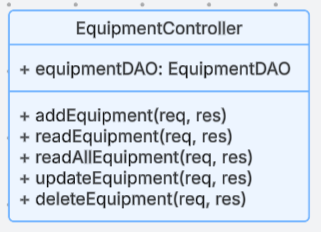
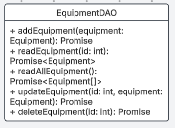

# Milestone 3

 - Author:  Cody Crosby
 - Date:  14 September 2025

## Links
 [Screen Cast](https://www.loom.com/share/8a31f9d11ea2418f8ee9baddbc4b4522?sid=bcd15ca9-c39f-41aa-baf1-690727f8294c)

 [PowerPoint](PPT.md)

## Introduction

 - This project is an online management application designed for a gym equipment catalog. It will allow users to perform standard CRUD operations on various equipment types, with all data stored in a MySQL database. The catalog will maintain details such as equipment availability, category, pricing, and other details. The backend will be built using Node.js and Express to provide RESTful APIs for data manipulation. Two separate front-end applications, one in Angular and the other in React, will utilize these APIs.

## Requirements

 - The application must:
    - Support CRUD (Create, Read, Update, Delete) operations on gym equipment through a REST API
    - Adhere to REST conventions:
        - Use plural nouns for resources
        - Use hierarchical paths for nested resources if needed
        - Use HTTP verbs (GET, POST, PUT, DELETE) to define actions
    - Allow users to view all available equipment in a list
    - Allow users to filter equipment by category
    - Store data in a MySQL database
    - Provide two separate front-ends, Angular and React, that use the same REST APIs

## Updates
 - This milestone was centered around building the backend REST APIs for the project. It was implemented using JavaScript/TypeScript, NodeJs, and Express, and all planned APIs were implemented.

 |Change|Purpose|Summary|
 |--|--|--|
 |Setup Server|Initialize the NodeJS/Express backend|Created app.ts file, configured Express, middleware, and logging|
 |Setup Database|Create and connect to MySQL DB|Created the MySQL database and implemented a connection service using environment variables|
 |Create APIs|Expose CRUD operation for the application|Implemented REST endpoints for GET, POST, PUT, and DELETE requests|
 |Structure Project|Organize code into layers|Organized the project into an N-layer architecture with separate folders for models, DAOs, controllers, routes, and middleware|

## Risks

 - Possible risks include: 
   - Invalid or incomplete data inputs causing database errors
   - Unhandled exceptions leading to unexpected behavior or application crashes
   - Compatibility issues integrating with multiple frontend frameworks
   - CConcurrent updates to the same record possibly corrupting data

## Sitemap

 - Below is the Sitemap ...

 

## Wireframes

 - Wireframes for:
    - Home Page

     
    - Search Page

     
    - Add/Edit Page

     
    - Details Page

     

## Database Design

 - Equipment ER Diagram

  

## Class Diagram

 - UML for:
    - Equipment Class

     
    - EquipmentController

     
    - EquipmentDAO

     

## REST Endpoints

 - [Postman Documentation](https://documenter.getpostman.com/view/43669754/2sB3HnLL6Z)

 |Method|Endpoint|Description|
 |--|--|--|
 |GET|/equipment|Retrieve a list of all gym equipment items|
 |GET|/equipment|Retrieve details for a ID specified in body|
 |POST|/equipment|Add a new equipment record to the database|
 |PUT|/equipment|Update an existing equipment item by its ID|
 |DELETE|/equipment/:id|Remove an equipment record from the database by its ID|

## API Example API Request

 ```json
   GET /equipment
    Response:
    [
      {
        "equipmentId": 1,
        "name": "Test",
        "category": "Test",
        "price": 199.99,
        "weight": 150,
        "isAvailable": 1
      },
      {
        "equipmentId": 2,
        "name": "Barbell",
        "category": "Freeweight",
        "price": 100,
        "weight": 45,
        "isAvailable": 1
      }
    ]
```

```json
   DELETE /equipment/:4
    Response:
    {
      "fieldCount": 0,
      "affectedRows": 1,
      "insertId": 0,
      "serverStatus": 2,
      "warningCount": 0,
      "message": "",
      "protocol41": true,
      "changedRows": 0
    }
 ```

## Conclusion

 - This milestone focused on implementing the backend REST APIs for the Gym Equipment application. It provided experience in building a well structured backend using TypeScript, NodeJs, and Express. Key takeaways include:
   - Following standard REST conventions
   - Structuring an N-layer architecture
   - Integrating with a MySQL database