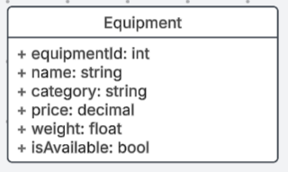

# Milestone 4

 - Author:  Cody Crosby
 - Date:  28 September 2025

## Links
 [Screen Cast](https://www.loom.com/share/3326288e3bde4f919e6afb362a2152f1?sid=f1d867a5-7c48-4be3-9bf4-310bd3df2744)

 [PowerPoint](PPT.pdf)

## Introduction

 - This project is an online management application designed for a gym equipment catalog. It will allow users to perform standard CRUD operations on various equipment types, with all data stored in a MySQL database. The catalog will maintain details such as equipment availability, category, pricing, and other details. The backend will be built using Node.js and Express to provide RESTful APIs for data manipulation. Two separate front-end applications, one in Angular and the other in React, will utilize these APIs.

## Requirements

 - The application must:
    - Support CRUD (Create, Read, Update, Delete) operations on gym equipment through a REST API
    - Adhere to REST conventions:
        - Use plural nouns for resources
        - Use hierarchical paths for nested resources if needed
        - Use HTTP verbs (GET, POST, PUT, DELETE) to define actions
    - Allow users to view all available equipment in a list
    - Allow users to filter equipment by category
    - Store data in a MySQL database
    - Provide two separate front-ends, Angular and React, that use the same REST APIs

## Updates

 - Created Angular front-end to consume Express REST APIs. This milestone included implementing the following features:

 |Change|Purpose|Summary|
 |--|--|--|
 |Added Angular routing and component structure|Enable navigating between views|Created standalone components for listing, creating, editing, and deleting equipment|
 |Integrated Angular forms with REST API|Enable data manipulation|Used FormsModule and ngModel to bind form inputs to equipment data|
 |Pre-filled edit form fields|Improve UX|Used equipment by ID and populated form fields for easier editing|
 |Added edit/delete actions to details view|Improved navigation|Added icons and buttons to transition between views|
 |Delete confirmation and cancel buttons|Prevent accidental deletions|Prompted user before deletion and allowed canceling the action|

 ### Known Issues

  - Occasional issue navigating back to equipment list when viewing details
  - Canceling delete returns to list, not equipment details
  - Search functionality not yet implemented

## Risks

 - Possible risks include: 
   - Invalid or incomplete data inputs causing database errors
   - Unhandled exceptions leading to unexpected behavior or application crashes
   - Compatibility issues integrating with multiple frontend frameworks
   - Concurrent updates to the same record possibly corrupting data
   - Inconsistent states when navigating between views

## Sitemap

 - Below is the Sitemap ...

 

## Wireframes

 - Wireframes for:
    - Home Page

     
    - Search Page

     
    - Add/Edit Page

     
    - Details Page

     

## Database Design

 - Equipment ER Diagram

  

## Class Diagram

 - Express APIs:
    - Equipment Class

     
    - EquipmentController

     
    - EquipmentDAO

     

 - Angular Front-End:
    - API Service

    
    - ListEquipment

    

    - EditEquipment

    

    - DeleteEquipment

    

    - CreateEquipment

    

## REST Endpoints

 - [Postman Documentation](https://documenter.getpostman.com/view/43669754/2sB3HnLL6Z)

 |Method|Endpoint|Description|
 |--|--|--|
 |GET|/equipment|Retrieve a list of all gym equipment items|
 |GET|/equipment|Retrieve details for a ID specified in body|
 |POST|/equipment|Add a new equipment record to the database|
 |PUT|/equipment|Update an existing equipment item by its ID|
 |DELETE|/equipment/:id|Remove an equipment record from the database by its ID|

## API Example API Request

 ```json
   GET /equipment
    Response:
    [
      {
        "equipmentId": 1,
        "name": "Test",
        "category": "Test",
        "price": 199.99,
        "weight": 150,
        "isAvailable": 1
      },
      {
        "equipmentId": 2,
        "name": "Barbell",
        "category": "Freeweight",
        "price": 100,
        "weight": 45,
        "isAvailable": 1
      }
    ]
```

```json
   DELETE /equipment/:4
    Response:
    {
      "fieldCount": 0,
      "affectedRows": 1,
      "insertId": 0,
      "serverStatus": 2,
      "warningCount": 0,
      "message": "",
      "protocol41": true,
      "changedRows": 0
    }
 ```

## Conclusion

 - This milestone focused on building the Angular front-end to consume the REST APIs developed in earlier stages. It provided experience integrating a frontend framework with a custom backend and reinforced key principles such as:
   - Component-based architecture and routing in Angular
   - Form binding and API integration using HttpClient
   - Debugging and logging for frontend-backend communication
   - Maintaining RESTful standards across the full stack