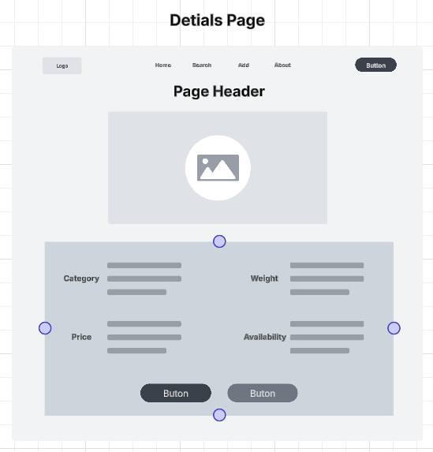

# Milestone 5

 - Author:  Cody Crosby
 - Date:  19 October 2025

## Links
 [Screen Cast]()

 [PowerPoint](PPT.pdf)

## Introduction

 - This project is an online management application designed for a gym equipment catalog. It will allow users to perform standard CRUD operations on various equipment types, with all data stored in a MySQL database. The catalog will maintain details such as equipment availability, category, pricing, and other details. The backend will be built using Node.js and Express to provide RESTful APIs for data manipulation. Two separate front-end applications, one in Angular and the other in React, will utilize these APIs.

## Requirements

 - The application must:
    - Support CRUD (Create, Read, Update, Delete) operations on gym equipment through a REST API
    - Adhere to REST conventions:
        - Use plural nouns for resources
        - Use hierarchical paths for nested resources if needed
        - Use HTTP verbs (GET, POST, PUT, DELETE) to define actions
    - Allow users to view all available equipment in a list
    - Allow users to filter equipment by category
    - Store data in a MySQL database
    - Provide two separate front-ends, Angular and React, that use the same REST APIs

## Updates

 - Implemented React front end to consume the existing Express REST APIs. This iteration included the following features:

 |Change|Purpose|Summary|
 |--|--|--|
 |Created React component structure|Enable navigating between views|Built standalone components for listing, creating/editing, and viewing equipment details using components and hooks|
 |Implemented state management|Manage equipment data|Used useState and useEffect to track equipment lists, search phrases, and selected equipment for editing or viewing|
 |Added search functionality|Filter equipment dynamically|Built a search input to filter displayed equipment cards by name and category|
 |Refactored card and form styling|Improve UI/UX|Styled equipment cards, edit/create forms, and buttons using a shared CSS inspired by Angular styling|
 |Connected forms to REST API|Enable CRUD operations|Created forms for adding/editing equipment, including controlled inputs and API calls|

 ### Known Issues

  - Minor formatting issues remain on some cards and forms when window width is very wide
  - Canceling eidt returns to equipment list, not deatils page
  - Occasional slight misalignment of buttons on the edit/create form

## Risks

 - Possible risks include: 
   - Invalid or incomplete data inputs causing database errors
   - Unhandled exceptions leading to unexpected behavior or application crashes
   - Compatibility issues integrating with multiple frontend frameworks
   - Concurrent updates to the same record possibly corrupting data
   - Inconsistent states when navigating between views

## Sitemap

 - Below is the Sitemap ...

 

## Wireframes

 - Wireframes for:
    - Home Page

     
    - Search Page

     
    - Add/Edit Page

     
    - Details Page

     

## Database Design

 - Equipment ER Diagram

  

## Class Diagram

 - Express APIs:
    - Equipment Class

     
    - EquipmentController

     
    - EquipmentDAO

     

 - Angular Front-End:
    - API Service

    
    - ListEquipment

    

    - EditEquipment

    

    - DeleteEquipment

    

    - CreateEquipment

    

## REST Endpoints

 - [Postman Documentation](https://documenter.getpostman.com/view/43669754/2sB3HnLL6Z)

 |Method|Endpoint|Description|
 |--|--|--|
 |GET|/equipment|Retrieve a list of all gym equipment items|
 |GET|/equipment|Retrieve details for a ID specified in body|
 |POST|/equipment|Add a new equipment record to the database|
 |PUT|/equipment|Update an existing equipment item by its ID|
 |DELETE|/equipment/:id|Remove an equipment record from the database by its ID|

## API Example API Request

 ```json
   GET /equipment
    Response:
    [
      {
        "equipmentId": 1,
        "name": "Test",
        "category": "Test",
        "price": 199.99,
        "weight": 150,
        "isAvailable": 1
      },
      {
        "equipmentId": 2,
        "name": "Barbell",
        "category": "Freeweight",
        "price": 100,
        "weight": 45,
        "isAvailable": 1
      }
    ]
```

```json
   DELETE /equipment/:4
    Response:
    {
      "fieldCount": 0,
      "affectedRows": 1,
      "insertId": 0,
      "serverStatus": 2,
      "warningCount": 0,
      "message": "",
      "protocol41": true,
      "changedRows": 0
    }
 ```

## Conclusion

 - This milestone expanded the project by adding a fully functional React front-end alongside the existing Angular front-end. It involved state management, routing, and form handling in React. Key takeaways from this iteration include:
   - Component-based design and routing in React using React Router
   - State management and form handling with controlled components
   - Using consistent CSS to match Angular aesthetic
   - Maintaining RESTful standards across the full stack